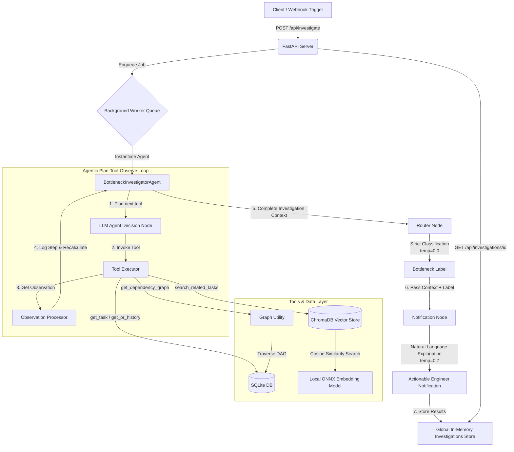

# TeamBoostAI — Mini System-Aware PR Bottleneck Investigator Architecture

This document maps out the system architecture, flowcharts, and technical data pipeline for the PR Bottleneck Investigator.

## Architectural Diagram

The diagram below details the end-to-end event flow, from the initial HTTP request to the database/graph/semantic lookups, the agent workflow, and finally the notification generation.

---

## Component Details

### 1. Ingestion & API Layer (`main.py`)
- Built using **FastAPI** to handle requests.
- Implements an **asynchronous job queue** via FastAPI's native `BackgroundTasks`. This returns a `202 Accepted` status and an `investigation_id` immediately, letting the client poll or webhooks trigger without blocking.

### 2. Graph & Relational Data Layer (`db.py` & `graph.py`)
- **SQLite Database**: Acts as the single source of truth for structured relational data (engineers, tasks, dependencies, PR events, and activity logs). Loaded with `seed.json` on startup.
- **DAG Analyzer**: Standard Python dictionary adjacency list. Navigates upstream blocking tasks recursively and assesses downstream impact (e.g. who is waiting on what). Supports hop-based undirected BFS traversals.

### 3. Embeddings & Semantic Search (`vector_store.py`)
- **Vector Database**: Runs **ChromaDB** persistent engine locally.
- **Embedding Model**: Utilizes Chroma's default **ONNX MiniLM-L6-v2** model locally (384 dimensions), avoiding dependencies on external network calls or keys.
- **Retrieval**: Combines metadata filtering (team, status, sprint, owner) and cosine similarity thresholding (`1.0 - cosine_distance`).

### 4. Agentic Workflow Loop (`agent.py`)
- Orchestrates tool calls in an iterative fashion (Plan -> Tool -> Observe).
- **Router Node**: Uses low-temperature (0.0) settings to output exact machine-readable classifications (`DEPENDENCY_BLOCK`, `SELF_STALL`, etc.).
- **Notification Node**: Uses a high-temperature (0.7) setting to phrase supportive, contextual developer notifications.
